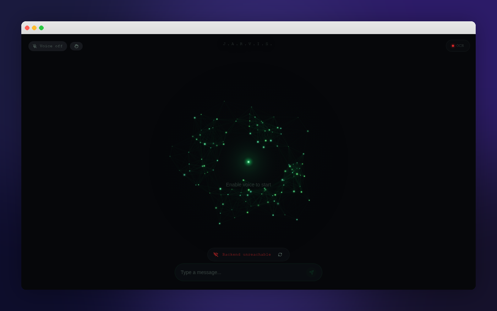

<p align="center">
  
</p>

<h1 align="center">J.A.R.V.I.S.</h1>
<p align="center">
  <strong>Just A Rather Very Intelligent System</strong><br/>
  Your personal AI assistant — voice control, gesture recognition, Obsidian memory, and local LLM intelligence. All running on your machine.
</p>

<p align="center">
  <a href="#features">Features</a> •
  <a href="#screenshots">Screenshots</a> •
  <a href="#installation">Installation</a> •
  <a href="#architecture">Architecture</a> •
  <a href="#development">Development</a> •
  <a href="#tech-stack">Tech Stack</a>
</p>

---

## Features

### 🗣️ Voice Control
- **Wake word detection** — say "Jarvis" to activate hands-free mode
- **Speech-to-text** via Web Speech API for natural voice input
- **Text-to-speech** responses — JARVIS speaks back to you
- Always-listening mode with visual feedback (idle → awake → listening)

### 🤖 Local AI (Ollama + TinyLlama)
- Runs entirely on your machine via [Ollama](https://ollama.ai)
- Powered by TinyLlama for fast, private responses
- No data leaves your computer — fully offline capable
- Backend API on `localhost:7474`

### ✋ Gesture Control
- **Webcam hand tracking** using TensorFlow.js + MediaPipe Hand Pose Detection
- **Built-in gestures**: Thumbs Up, Peace Sign, Open Palm, Fist
- **Custom gestures**: Record your own hand poses and map them to system commands
- Gesture actions: toggle voice, clear chat, save to Obsidian, media controls, volume, screenshots

<p align="center">
  
</p>

### 📓 Obsidian Memory
- Connects directly to your [Obsidian](https://obsidian.md) vault (`C:\Users\jamie\Documents\Obsidian Vault`)
- **Save conversations** as timestamped Markdown notes in `JARVIS/` folder
- **Search knowledge** across your entire vault from within JARVIS
- Persistent memory — JARVIS remembers past conversations via your vault
- Path traversal protection built in

### 📊 System Vitals HUD
- Real-time CPU and memory usage overlay
- Sleek monospace HUD in the top-right corner
- Polls system stats from the backend every 3 seconds

### 🔌 Connection Status
- Live backend connectivity indicator
- Auto-retry with manual retry button
- Visual status: Connected (green) / Unreachable (red)

### 🖥️ Electron Desktop App
- Frameless, dark-themed native window
- Packaged for Windows with `@electron/packager`
- Preload script with secure `contextBridge` for vault IPC
- Auto-loads the built web app from `dist/`

---

## Screenshots

| Chat Interface | Gesture Config |
|:-:|:-:|
|  |  |

**Chat Interface** — Particle animation background reacts to voice/speech state. Connection status bar, voice toggle, gesture shortcut, and Obsidian vault indicator in the HUD.

**Gesture Config** — Live webcam feed with hand detection. Record custom gestures, name them, and assign system commands. Built-in gesture library included.

---

## Installation

### Quick Install (Windows)

1. **Download** `JARVIS-Setup.exe` from the [Releases](https://github.com/your-repo/jarvis/releases/latest) page (or visit the landing page at `/`)
2. Run the installer — the download auto-starts after 1.5 seconds

### Prerequisites

| Dependency | Purpose |
|---|---|
| [Ollama](https://ollama.ai) | Local LLM runtime |
| [Python 3.10+](https://python.org) | Backend server |
| [Node.js 18+](https://nodejs.org) | Frontend build |
| [Obsidian](https://obsidian.md) | Knowledge vault (optional) |

### Setup Steps

```bash
# 1. Install Ollama and pull the model
ollama pull tinyllama

# 2. Start the JARVIS backend
python main.py
# Backend runs on http://localhost:7474

# 3. Install frontend dependencies
npm install

# 4. Run in development mode
npm run dev

# 5. Or build and run as Electron app
npm run electron:dev
```

### Package for Windows

```bash
npm run electron:package
# Output: electron-release/JARVIS-linux-x64/
```

---

## Architecture

```
┌─────────────────────────────────────────┐
│              Electron Shell             │
│  ┌───────────────────────────────────┐  │
│  │         React Frontend            │  │
│  │  ┌─────────┐  ┌───────────────┐   │  │
│  │  │  Chat   │  │  Gesture      │   │  │
│  │  │  UI     │  │  Config       │   │  │
│  │  └────┬────┘  └───────┬───────┘   │  │
│  │       │               │           │  │
│  │  ┌────┴────┐  ┌───────┴───────┐   │  │
│  │  │ Speech  │  │ TensorFlow.js │   │  │
│  │  │ API     │  │ Hand Pose     │   │  │
│  │  └────┬────┘  └───────────────┘   │  │
│  └───────┼───────────────────────────┘  │
│          │          IPC Bridge           │
│  ┌───────┴───────────────────────────┐  │
│  │        Obsidian Vault I/O         │  │
│  │   read · write · list · search    │  │
│  └───────────────────────────────────┘  │
└──────────┬──────────────────────────────┘
           │ HTTP (localhost:7474)
┌──────────┴──────────────────────────────┐
│          Python Backend                 │
│  ┌──────────┐  ┌────────────────────┐   │
│  │  Ollama  │  │  System Vitals     │   │
│  │ TinyLlama│  │  CPU / Memory      │   │
│  └──────────┘  └────────────────────┘   │
└─────────────────────────────────────────┘
```

---

## Project Structure

```
├── electron/
│   ├── main.cjs          # Electron main process + vault IPC
│   └── preload.cjs       # Context bridge for secure IPC
├── src/
│   ├── components/
│   │   ├── ChatBubble.tsx       # Message bubbles with animations
│   │   ├── ChatInput.tsx        # Text input with send button
│   │   ├── ConnectionStatus.tsx # Backend status indicator
│   │   ├── ParticleCanvas.tsx   # Animated particle background
│   │   ├── SystemVitals.tsx     # CPU/memory HUD overlay
│   │   └── TypingIndicator.tsx  # "JARVIS is thinking" animation
│   ├── hooks/
│   │   ├── use-gestures.ts      # TF.js hand detection + gesture CRUD
│   │   └── use-speech.ts        # Wake word + speech recognition
│   ├── lib/
│   │   ├── jarvis-api.ts        # Backend HTTP client
│   │   └── obsidian.ts          # Vault read/write/search helpers
│   ├── pages/
│   │   ├── Index.tsx            # Main chat interface
│   │   ├── Download.tsx         # Landing/download page
│   │   └── GestureConfig.tsx    # Gesture recording & management
│   └── main.tsx
├── package.json
├── vite.config.ts
└── tailwind.config.ts
```

---

## Tech Stack

| Layer | Technology |
|---|---|
| **Frontend** | React 18, TypeScript, Vite 5 |
| **Styling** | Tailwind CSS 3, shadcn/ui |
| **Desktop** | Electron 41 |
| **AI/ML** | TensorFlow.js, MediaPipe Hand Pose |
| **Voice** | Web Speech API (recognition + synthesis) |
| **LLM** | Ollama + TinyLlama (local) |
| **Knowledge** | Obsidian vault (Markdown) |
| **Backend** | Python (localhost:7474) |

---

## API Endpoints

The Python backend exposes these endpoints on `http://localhost:7474`:

| Method | Endpoint | Description |
|---|---|---|
| `GET` | `/health` | Health check / connectivity |
| `POST` | `/chat` | Send message, get AI response |
| `GET` | `/history?limit=N` | Fetch chat history |
| `GET` | `/vitals` | CPU & memory usage |

---

## Development

```bash
# Install dependencies
npm install

# Start dev server (web only)
npm run dev

# Build for production
npm run build

# Run Electron in dev mode
npm run electron:dev

# Package Electron app
npm run electron:package

# Run tests
npm test
```

---

## License

MIT

---

<p align="center">
  Built with ❤️ using <a href="https://lovable.dev">Lovable</a>
</p>
